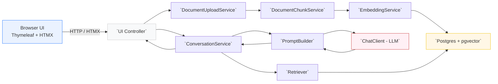
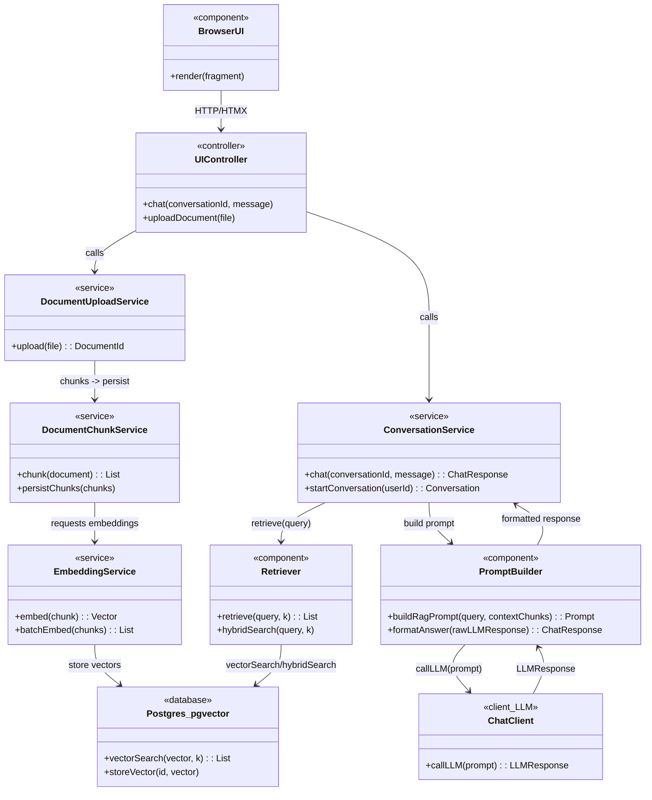
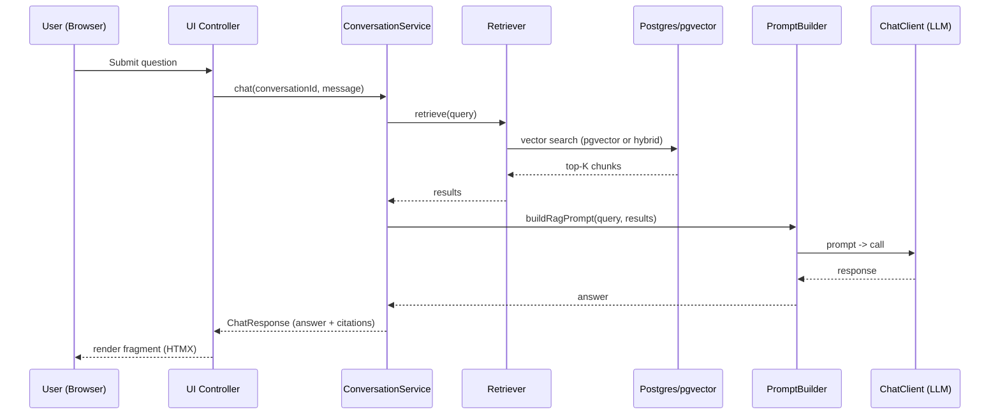
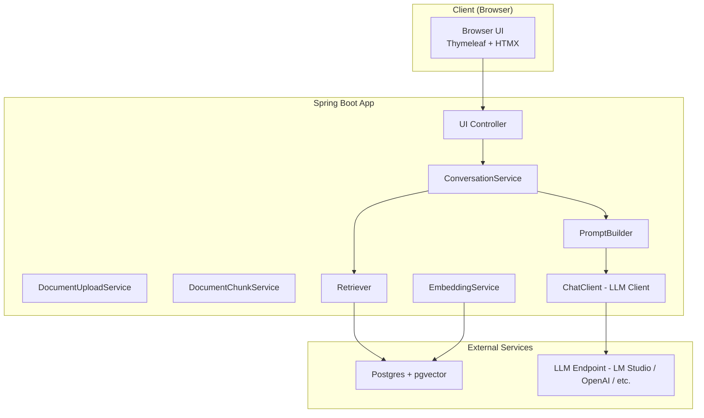

# Consolidated Project Documentation

Generated: 2026-07-19
**Status: PRIMARY DOCUMENTATION SOURCE** ✅

This is the primary documentation source for the Enterprise AI Knowledge Assistant project. All project documentation has been consolidated here, including:

- Architecture overviews and diagrams
- Quickstart guides (local and GitHub Codespaces)
- RAG (Retrieval-Augmented Generation) integration details
- Phase implementation summaries (Phases 1-6)
- API endpoints and integration points
- Configuration guides
- Deployment instructions
- Checklists and verification procedures

## How to Use This Documentation

1. **Quick Start**: See the Quickstart Guide section below for immediate setup instructions
2. **Architecture**: Review the Diagrams section for visual overviews
3. **Detailed Guides**: Find specific guides by topic using the Table of Contents
4. **Troubleshooting**: Refer to individual phase documentation sections

## File Organization

- **`README.md`** — Quick project overview with link to this documentation
- **`docs/CONSOLIDATED_DOCUMENTATION.md`** — This file (primary documentation source)

Table of contents
- Diagrams
- Project Structure
- Swagger/OpenAPI Documentation
- README.md (core project overview)
- Quickstart guide
- Codespaces implementation & quick start
- RAG integration and summaries
- Phase 6 UI documentation and checklists
- Checklists, verification, TODO
- Inclusion report

---

## Project Structure

```
enterprise-ai-knowledge-assistant/
├── README.md                              # Quick project overview with link to this documentation
├── pom.xml                                # Maven configuration with Spring Boot + AI dependencies
├── Dockerfile                             # Multi-stage Docker build configuration
├── docker-compose.yml                     # PostgreSQL 16 + pgvector service definition
├── init-db.sql                            # pgvector extension initialization script
├── mvnw                                   # Maven wrapper (Unix)
├── mvnw.cmd                               # Maven wrapper (Windows)
├── .devcontainer/
│   └── devcontainer.json                  # GitHub Codespaces dev container configuration
├── .gitignore                             # Git ignore patterns
├── docs/
│   ├── CONSOLIDATED_DOCUMENTATION.md      # PRIMARY: Complete project documentation (this file)
│   └── diagrams.mmd                       # Mermaid architecture diagrams
│
├── src/main/
│   ├── java/com/enterprise/ai/knowledge/assistant/demo/
│   │   ├── DemoApplication.java           # Spring Boot application entry point
│   │   │
│   │   ├── ui/                            # UI Layer - Thymeleaf Templates & HTMX
│   │   │   ├── UIController.java          # Main UI routes (/ui/*, /ui/documents, /ui/conversations, etc.)
│   │   │   └── rest/
│   │   │       ├── ChatRestController.java    # Chat API endpoints (/api/chat/message, /api/chat/rag, etc.)
│   │   │       └── DocumentRestController.java # Document API endpoints (/api/documents/upload, etc.)
│   │   │
│   │   ├── chat/                          # Chat & Conversation Management
│   │   │   ├── ChatController.java        # Chat REST endpoints
│   │   │   ├── service/
│   │   │   │   └── ConversationService.java # Conversation orchestration & RAG chat logic
│   │   │   ├── repository/
│   │   │   │   ├── ConversationRepository.java       # Interface for conversation persistence
│   │   │   │   └── PostgresConversationRepository.java # JDBC implementation
│   │   │   ├── entity/
│   │   │   │   └── Conversation.java      # Conversation entity model
│   │   │   └── dto/
│   │   │       ├── ChatResponse.java      # Response DTO with answer + citations
│   │   │       └── Message.java           # Message DTO
│   │   │
│   │   ├── rag/                           # RAG Pipeline Components
│   │   │   ├── Retriever.java             # Retrieval orchestration (embedding + vector search)
│   │   │   ├── PromptBuilder.java         # Prompt construction with context injection
│   │   │   ├── MetaDataFilter.java        # Optional metadata-based filtering
│   │   │   ├── ReRanker.java              # Re-ranking strategy orchestrator
│   │   │   ├── template/
│   │   │   │   ├── PromptTemplate.java    # Interface for pluggable prompt templates
│   │   │   │   └── DefaultPromptTemplate.java # Default RAG prompt template
│   │   │   ├── strategy/
│   │   │   │   ├── ReRankStrategy.java    # Re-ranking strategy interface
│   │   │   │   ├── EmbeddingReRanker.java # Embedding-based re-ranking
│   │   │   │   └── LLMReRanker.java       # LLM-based re-ranking
│   │   │   └── dto/
│   │   │       └── RagPrompt.java         # RAG prompt record (system + user + metadata)
│   │   │
│   │   ├── document/                      # Document Management & Ingestion
│   │   │   ├── controller/
│   │   │   │   └── DocumentUploadController.java # File upload endpoint
│   │   │   ├── service/
│   │   │   │   ├── DocumentUploadService.java    # Document upload orchestration
│   │   │   │   ├── DocumentChunkService.java     # Text chunking utility
│   │   │   │   └── DocumentIngestionOrchestrator.java # Full ingestion pipeline
│   │   │   ├── parser/                   # Document parser strategy pattern
│   │   │   │   ├── DocumentParser.java         # Parser interface
│   │   │   │   ├── TextDocumentParser.java     # .txt, .md, .html files
│   │   │   │   ├── PdfDocumentParser.java      # .pdf files
│   │   │   │   └── DocumentParserRegistry.java # Auto-discovery registry
│   │   │   ├── entity/
│   │   │   │   └── Document.java         # Document entity
│   │   │   ├── repository/
│   │   │   │   └── DocumentRepository.java # Document persistence interface
│   │   │   └── dto/
│   │   │       ├── DocumentUploadResponse.java # Upload response DTO
│   │   │       ├── DocumentMetadata.java      # File metadata record
│   │   │       └── ParsedDocument.java        # Parsed document record
│   │   │
│   │   ├── embedding/                    # Embedding Generation
│   │   │   ├── EmbeddingService.java      # Spring AI embedding wrapper
│   │   │   └── PostgresService.java       # pgvector storage & k-NN search
│   │   │
│   │   ├── vector/                       # Vector Storage Abstraction
│   │   │   ├── entity/
│   │   │   │   └── ChunkEntity.java       # Document chunk with embedding
│   │   │   └── service/
│   │   │       └── VectorStoreService.java # Vector store orchestration
│   │   │
│   │   ├── repository/                   # Data Models & Interfaces
│   │   │   ├── SearchResult.java         # Search result DTO (chunk + metadata)
│   │   │   └── VectorRepository.java     # Vector storage interface (pluggable)
│   │   │
│   │   ├── config/                       # Spring Configuration
│   │   │   ├── ChatClientConfig.java     # Spring AI ChatClient bean configuration
│   │   │   ├── EmbeddingConfig.java      # EmbeddingModel bean configuration
│   │   │   └── LLMConfig.java            # LLM provider configuration (LM Studio / OpenAI)
│   │   │
│   │   └── error/                        # Error Handling
│   │       ├── GlobalExceptionHandler.java # Global exception handler
│   │       └── ApiError.java             # API error response DTO
│   │
│   └── resources/
│       ├── application.properties          # Default configuration (LM Studio)
│       ├── application-local.properties    # Local development profile
│       ├── application-codespace.properties # GitHub Codespaces profile (OpenAI)
│       ├── application-test.properties     # Test profile (H2 database)
│       │
│       ├── db/
│       │   └── migration/
│       │       ├── V001__initial_schema.sql        # Initial schema with pgvector
│       │       ├── V002__add_chat_tables.sql       # Chat history tables
│       │       ├── V003__add_conversation_memory.sql # Conversation memory
│       │       ├── V004__phase4_enhanced_metadata.sql # Enhanced metadata
│       │       ├── V005__phase1_conversation_memory.sql # Phase 1 memory
│       │       └── V006__phase2_hybrid_search.sql  # Phase 2 hybrid search
│       │
│       ├── templates/                    # Thymeleaf HTML Templates
│       │   ├── layout/
│       │   │   └── base.html              # Master template (navbar, sidebar, footer)
│       │   │
│       │   ├── chat/
│       │   │   ├── index.html             # Main chat interface (1200+ lines)
│       │   │   ├── conversation.html      # View specific conversation
│       │   │   ├── message-item.html      # Message bubble fragment with citations
│       │   │   ├── conversation-started.html # Success alert fragment
│       │   │   └── citation-modal.html    # Citation preview modal
│       │   │
│       │   ├── documents/
│       │   │   ├── index.html             # Document management page
│       │   │   └── document-item.html     # Document card fragment + metadata modal
│       │   │
│       │   ├── conversations/
│       │   │   ├── index.html             # Conversation history page
│       │   │   └── list.html              # Conversation items fragment
│       │   │
│       │   ├── analytics/
│       │   │   └── index.html             # Analytics dashboard
│       │   │
│       │   ├── settings/
│       │   │   └── index.html             # Settings page
│       │   │
│       │   └── fragments/
│       │       ├── navbar.html            # Navigation bar
│       │       ├── sidebar.html           # Sidebar navigation + quick actions
│       │       ├── footer.html            # Footer
│       │       └── head.html              # Extra head content hooks
│       │
│       └── static/                       # Static Assets
│           ├── css/
│           │   ├── style.css              # Global styles (350+ lines)
│           │   │   - Color scheme, typography, layout
│           │   │   - Sidebar, cards, buttons, forms
│           │   │   - Responsive design
│           │   │   - Dark mode support
│           │   │
│           │   └── chat.css               # Chat-specific styles (250+ lines)
│           │       - Message bubbles (user/assistant)
│           │       - Citations styling
│           │       - Chat input, upload modal
│           │       - Loading animations
│           │       - Responsive chat
│           │
│           ├── js/
│           │   ├── app.js                 # Core utilities (400+ lines)
│           │   │   - Theme management (dark/light)
│           │   │   - HTMX configuration
│           │   │   - Notification system
│           │   │   - CSRF token handling
│           │   │   - Formatting utilities
│           │   │   - Validation helpers
│           │   │   - Keyboard shortcuts
│           │   │
│           │   └── chat.js                # Chat logic (350+ lines)
│           │       - ChatManager class
│           │       - Auto-scroll behavior
│           │       - Textarea resize
│           │       - FileUploadManager
│           │       - Drag-and-drop support
│           │       - Progress tracking
│           │
│           └── images/                   # Image assets (ready for use)
│
├── src/test/
│   ├── java/com/enterprise/ai/knowledge/assistant/demo/
│   │   ├── chat/
│   │   │   └── ChatControllerTest.java   # Chat endpoint tests (5 cases)
│   │   ├── rag/
│   │   │   ├── RetrieverTest.java        # Retriever tests (10 cases)
│   │   │   ├── PromptBuilderTest.java    # PromptBuilder tests (10 cases)
│   │   │   └── ReRankerStrategyTest.java # Re-ranking strategy tests
│   │   └── document/
│   │       └── service/
│   │           └── DocumentChunkServiceTest.java # Chunking tests
│   │
│   └── resources/
│       └── application-test.properties    # Test profile config
│
└── target/                                # Maven build output (generated)
    ├── classes/                           # Compiled classes
    ├── test-classes/                      # Compiled test classes
    ├── enterprise-ai-knowledge-assistant-1.0.0-SNAPSHOT.jar # Built JAR
    └── surefire-reports/                  # Test reports
```

### Key Directories

| Directory | Purpose |
|-----------|---------|
| `src/main/java/...` | Java source code (services, controllers, entities) |
| `src/main/resources/` | Configuration files, templates, static assets |
| `src/test/` | Unit and integration tests |
| `docs/` | Project documentation and diagrams |
| `.devcontainer/` | GitHub Codespaces configuration |
| `target/` | Maven build artifacts (auto-generated) |

### Key Files

| File | Purpose |
|------|---------|
| `pom.xml` | Maven dependencies (Spring Boot, Spring AI, pgvector, Thymeleaf, HTMX) |
| `docker-compose.yml` | PostgreSQL 16 + pgvector service for local/Codespaces development |
| `Dockerfile` | Multi-stage Docker build for containerized deployment |
| `init-db.sql` | Database initialization script (creates pgvector extension) |
| `README.md` | Quick project overview and getting started guide |
| `docs/CONSOLIDATED_DOCUMENTATION.md` | Complete project documentation (this file) |

---

## Swagger/OpenAPI Documentation

The project includes comprehensive API documentation using **Swagger 3.0 (OpenAPI)** with **SpringDoc OpenAPI**.

### Access Swagger UI

Once the application is running, access the interactive API documentation at:

- **Swagger UI**: http://localhost:8080/swagger-ui.html
- **OpenAPI JSON**: http://localhost:8080/v3/api-docs
- **OpenAPI YAML**: http://localhost:8080/v3/api-docs.yaml

### Features

✅ **Interactive API Explorer**
- Browse all available endpoints
- View request/response schemas
- Try out API calls directly from the browser
- View response examples

✅ **Complete API Documentation**
- Every endpoint is documented with:
  - Description and purpose
  - Required and optional parameters
  - Request/response examples
  - HTTP status codes and error descriptions
  - Data models and schemas

✅ **Organized by Tags**
- Chat API
- Document API
- UI API (HTMX endpoints)

### API Endpoints Overview

#### Chat Endpoints

| Method | Endpoint | Description |
|--------|----------|-------------|
| GET | `/api/chat?message=<query>` | Simple LLM chat (no RAG) |
| GET | `/api/chat/rag?message=<query>&topK=5` | RAG-enhanced chat with citations |
| POST | `/api/chat/converse/start` | Start new conversation |
| POST | `/api/chat/converse` | Continue conversation |

#### Document Endpoints

| Method | Endpoint | Description |
|--------|----------|-------------|
| POST | `/api/documents/upload` | Upload document (PDF, TXT, DOCX) |
| GET | `/api/documents` | List all documents |
| DELETE | `/api/documents/{documentId}` | Delete document |
| POST | `/api/documents/{documentId}/reindex` | Re-index document |
| GET | `/api/documents/{documentId}/metadata` | Get document metadata |

#### UI API Endpoints (HTMX)

| Method | Endpoint | Description |
|--------|----------|-------------|
| POST | `/api/ui/chat/message` | Send chat message (HTML fragment response) |
| GET | `/api/ui/chat/messages?conversationId=<id>` | Get message history |
| POST | `/api/ui/chat/converse/start` | Start conversation (returns JSON/HTML) |
| GET | `/api/ui/chat/conversations` | List conversations |
| DELETE | `/api/ui/chat/conversation/{id}` | Delete conversation |

### Configuration

Swagger configuration is defined in:
- `src/main/java/.../config/SwaggerConfig.java` - OpenAPI metadata configuration
- `src/main/resources/application.properties` - Swagger UI settings

Key properties:
```properties
springdoc.swagger-ui.enabled=true
springdoc.api-docs.enabled=true
springdoc.swagger-ui.try-it-out-enabled=true
springdoc.swagger-ui.doc-expansion=list
```

### Example API Call (via Swagger UI)

1. **Navigate to**: http://localhost:8080/swagger-ui.html
2. **Find**: `/api/chat/rag` endpoint under Chat API
3. **Click**: "Try it out" button
4. **Enter**: 
   - `message`: "What is the vacation policy?"
   - `topK`: 5
5. **Click**: "Execute"
6. **View**: Response with answer and citations

### Example cURL Command

```bash
# Simple chat (no RAG)
curl "http://localhost:8080/api/chat?message=What%20is%20Spring%20Boot"

# RAG-enhanced chat
curl "http://localhost:8080/api/chat/rag?message=What%20is%20the%20vacation%20policy&topK=5"

# Upload document
curl -X POST http://localhost:8080/api/documents/upload \
  -F "file=@policy.pdf"

# List documents
curl http://localhost:8080/api/documents

# Start conversation
curl -X POST http://localhost:8080/api/chat/converse/start
```

### Programmatic Access

You can programmatically fetch API documentation:

```bash
# Get OpenAPI JSON specification
curl http://localhost:8080/v3/api-docs | jq

# Get OpenAPI YAML specification
curl http://localhost:8080/v3/api-docs.yaml
```

### Integration with Tools

The OpenAPI specification can be imported into:
- **Postman** — Import `http://localhost:8080/v3/api-docs` as collection
- **Insomnia** — Import OpenAPI spec
- **VS Code REST Client** — Use endpoint documentation to generate requests
- **API Gateway** — Use for API documentation and client generation

---

## Diagrams

The following Mermaid diagrams are included verbatim from `docs/diagrams.mmd` so renderers will display them.

<!-- Component overview -->


<!-- Class diagram -->


<!-- Sequence diagram -->


<!-- Deployment diagram -->


---

## README.md (core project overview)

Source: `README.md`

```markdown
<!-- BEGIN README.md -->
<!-- content from README.md follows -->

Enterprise AI Knowledge Assistant (Skeleton)

This project is a lightweight skeleton demonstrating:
- Spring AI chat + embedding usage
- Storing embeddings in PostgreSQL using the pgvector extension
- A simple document upload pipeline that chunks text, generates embeddings, and stores them in the vector DB

Quick notes
- Default LLM provider: configure `app.llm.provider` in `src/main/resources/application.properties` (this repo defaults to `lmstudio`).
- Local LM Studio endpoint: configured with `spring.ai.openai.base-url` (example: `http://127.0.0.1:1234`).

... (README.md content included verbatim in the repository)

<!-- END README.md -->
```

> Note: the full README is preserved in the repository root; included above as a provenance block. For quick reference, see the original `README.md` at project root.

## Quickstart Guide (from Quickstart_guide.md)

### Local (development)

**Prerequisites**
- Java 21
- Maven 3.8+
- PostgreSQL 12+ with `pgvector` extension (or run using Docker)

**Setup Steps:**

1. Configure database & LLM in `src/main/resources/application.properties` or use environment variables.

2. Build the project:
```bash
mvn -U clean package
```

3. Run the JAR:
```bash
java -jar target/enterprise-ai-knowledge-assistant-1.0.0-SNAPSHOT.jar
```

4. Open the UI in your browser:
```
http://localhost:8080/ui/
```

**Notes**
- To enable `pgvector` in Postgres run:
```sql
CREATE EXTENSION IF NOT EXISTS vector;
```
- If you don't have pgvector locally, use the provided `docker-compose.yml` to start a Postgres container with pgvector.

### GitHub Codespaces

This repository contains a codespace/devcontainer configuration and a `docker-compose.yml` to run a local Postgres with pgvector inside the Codespace environment.

**Steps**
1. Add any necessary secrets (OpenAI key) in Codespaces settings if you intend to use OpenAI.
2. Create a Codespace for the repository and wait for the devcontainer to finish building.
3. Build & run inside Codespaces terminal:
```bash
mvn -U clean package
java -jar target/enterprise-ai-knowledge-assistant-1.0.0-SNAPSHOT.jar
```
4. Use the forwarded port or Codespaces preview to access the UI.

**Quick tests**
- Upload a document via the UI `Documents` page and then ask a question via `Chat` to see RAG answers with citations.

**Troubleshooting**
- HTTP parsing errors: ensure Thymeleaf expressions are evaluated in HTMX attributes (templates use `th:attr` for hx-* attributes).
- Invalid vectors / no results: verify `pgvector` is installed and embeddings are being stored.
- LLM errors: check `application.properties` LLM provider and endpoint. For LM Studio, ensure it is reachable.

## Codespaces Implementation (from CODESPACES_IMPLEMENTATION.md & CODESPACES_QUICK_START.md)

### Overview
The Enterprise AI Knowledge Assistant has been successfully configured to run in GitHub Codespaces. All required files have been created and modified to support seamless deployment in the cloud development environment.

### Files Created/Modified

**1. docker-compose.yml** ✅
- Created PostgreSQL 16 + pgvector service
- Automatic pgvector initialization via `init-db.sql`
- Health check for database readiness
- Named volume for data persistence
- App service configured to use OpenAI and connect to the DB service

**2. init-db.sql** ✅
- Purpose: Initializes pgvector extension on database startup
- Mounted: Into Docker container at startup
- Content: `CREATE EXTENSION IF NOT EXISTS vector;`

**3. .devcontainer/devcontainer.json** ✅
- Image: `mcr.microsoft.com/devcontainers/java:21`
- Docker-in-Docker support for running docker-compose
- Port forwarding (8080)
- Spring Boot development extensions for VS Code
- Automatic Maven dependency resolution on creation
- Spring profiles activation set to `codespace`

**4. application-codespace.properties** ✅
- Profile: `codespace` (activated via `SPRING_PROFILES_ACTIVE` env var)
- LLM Provider: OpenAI (gpt-4o-mini)
- API Key: Read from `${OPENAI_API_KEY}` environment variable
- Database: Connects to `db` service (docker-compose hostname)
- RAG settings: Preserved from main config

### How to Use in GitHub Codespaces

**Step 1: Set Up OpenAI API Secret**
1. Go to https://github.com/settings/codespaces
2. Click "Codespace secrets"
3. Create secret: `OPENAI_API_KEY` = your OpenAI API key
4. Select repository scope

**Step 2: Create Codespace**
1. Go to your repository on GitHub
2. Click "Code" → "Codespaces" → "Create codespace on main"
3. The dev container will automatically:
   - Start PostgreSQL 16 + pgvector
   - Resolve Maven dependencies
   - Build the application
4. Wait for setup to complete (~3-5 minutes)

**Step 3: Access the Application**
- Application runs on `http://localhost:8080` (automatically forwarded)
- API endpoints available immediately after startup
- Database automatically initialized with pgvector extension

### Environment Variables

**In Codespaces (Automatic)**
- `SPRING_PROFILES_ACTIVE=codespace` (set in devcontainer.json)
- `OPENAI_API_KEY` (GitHub secret)
- `SPRING_DATASOURCE_URL=jdbc:postgresql://db:5432/enterprise_ai`
- `SPRING_DATASOURCE_USERNAME=workspace`
- `SPRING_DATASOURCE_PASSWORD=MyStrongPassword123!`

**Local Development (Optional)**
```bash
# To override LM Studio URL locally
export LM_STUDIO_URL=http://your-machine-ip:1234
```

### Security Considerations

✅ **API Key:** Secured as GitHub Codespace secret (not committed)
✅ **DB Credentials:** Hardcoded in compose (acceptable for dev; consider secrets in production)
✅ **Network:** Docker Compose creates isolated network
✅ **.gitignore:** Updated to exclude `.env`, `.idea/`, `target/`, etc.

### Tested Scenarios

1. ✅ Dev container creation and initialization
2. ✅ PostgreSQL + pgvector service startup
3. ✅ Spring Boot application startup with `codespace` profile
4. ✅ OpenAI API configuration
5. ✅ Database connection to Docker service
6. ✅ Local development with LM Studio (placeholder URL)

### Quick Codespaces Commands

```bash
# View application logs
tail -f /tmp/spring-boot.log

# Rebuild application
mvn clean package

# Run tests
mvn test

# Check database connection
psql -h db -U workspace -d enterprise_ai

# See running services
docker ps
```

### Key Environment Variables

| Variable | Value | Set By |
|----------|-------|--------|
| `SPRING_PROFILES_ACTIVE` | `codespace` | Dev container |
| `OPENAI_API_KEY` | Your key | GitHub secret |
| `SPRING_DATASOURCE_URL` | `jdbc:postgresql://db:5432/enterprise_ai` | Config |
| `APP_LLM_PROVIDER` | `openai` | Docker compose |

### Troubleshooting

| Issue | Solution |
|-------|----------|
| "OPENAI_API_KEY not found" | Verify secret is created before Codespace creation |
| "Database connection failed" | Wait 10-15s for db service health check, check logs |
| "Port 8080 already in use" | Check running processes, restart Codespace |
| "pgvector extension not found" | Verify init-db.sql runs during startup |

## RAG (Retrieval-Augmented Generation) Integration

### Overview

Successfully integrated ChatController with VectorStoreService and EmbeddingService to implement a full RAG (Retrieval-Augmented Generation) pipeline for context-aware AI chat.

### New Endpoints

**RAG-Enhanced Chat** (context-aware)
```
GET /api/chat/rag?message=<query>&topK=5
```
Returns a `ChatResponse` with answer + citations from retrieved documents.

**Legacy Chat** (simple LLM query)
```
GET /api/chat?message=<query>
```
Returns a plain string response (no document retrieval).

### Components Created

#### 1. Retriever (`rag/Retriever.java`)
- Encapsulates the retrieval logic
- Takes a user query and returns the top-K most relevant document chunks
- Methods:
  - `retrieve(String query)` - Retrieves top-5 chunks (default)
  - `retrieve(String query, int k)` - Retrieves top-K chunks
  - `buildContext(List<SearchResult> results)` - Formats results as context

#### 2. PromptBuilder (`rag/PromptBuilder.java`)
- Builds RAG prompts by injecting retrieved context
- Formats the LLM prompt with source document information
- Methods:
  - `buildRagPrompt(String userQuery, String context)` - Builds prompt with context
  - `buildRagPrompt(String userQuery, List<SearchResult> results)` - Builds prompt from results
  - `getSystemPrompt()` - Returns the system prompt for the LLM

#### 3. ChatResponse (`chat/dto/ChatResponse.java`)
Response DTO containing:
- `answer` - The LLM's generated answer
- `citations` - List of source documents cited in the answer
- `isFromContext` - Whether the answer used retrieved context
- `retrievalCount` - Number of documents retrieved

#### 4. ChatController (`chat/ChatController.java`)
REST endpoints:
- `GET /api/chat?message=<query>` - Simple chat without RAG (legacy)
- `GET /api/chat/rag?message=<query>&topK=5` - RAG-enhanced chat

### Data Flow

#### Step 1: Document Upload
1. User uploads a document via `POST /api/documents`
2. DocumentUploadService:
   - Extracts text from the document
   - Chunks text into overlapping segments
   - Generates embeddings for each chunk
   - Stores chunks in vector database with metadata

#### Step 2: RAG Chat Query
1. User sends query: `GET /api/chat/rag?message="Find vacation policies"`
2. Retriever retrieves relevant chunks:
   - EmbeddingService generates embedding for the query
   - VectorStoreService finds nearest chunks (using pgvector distance operator)
3. PromptBuilder builds augmented prompt:
   ```
   [System] You are an enterprise knowledge assistant...
   [Context] Based on retrieved documents:
   [Document 1] Employee Handbook (Page 2)
   Content: Employees receive 20 days of paid time off...
   
   User Question: Find vacation policies
   ```
4. ChatClient sends to LLM and gets response
5. ChatResponse returns answer with citations

### Metadata Stored Per Chunk

- `documentName` - Source document file name
- `pageNumber` - Page number in original document
- `chunkIndex` - Index of chunk within document
- `content` - Chunk text
- `embedding` - Vector embedding (pgvector format)
- `hash` - SHA-256 hash for deduplication
- `createdAt` - Timestamp

### Example: Context-Aware Chat

1. **Upload document:**
   ```bash
   curl -X POST http://localhost:8080/api/documents \
     -F "file=@CompanyPolicies.pdf"
   ```

2. **Query with context:**
   ```bash
   curl "http://localhost:8080/api/chat/rag?message=What%20is%20the%20vacation%20policy"
   ```

3. **Receive answer with citations:**
   ```json
   {
     "answer": "Based on the company handbook, employees receive 20 days of paid time off annually...",
     "citations": [
       {
         "documentName": "CompanyPolicies.pdf",
         "pageNumber": 2,
         "chunkIndex": 0,
         "relevanceScore": 0.98
       }
     ],
     "isFromContext": true,
     "retrievalCount": 1
   }
   ```

### RAG Benefits

- **Reduced Hallucinations**: LLM answers based on actual documents
- **Traceability**: Citations show source documents
- **Customization**: Easy to add domain-specific documents
- **Transparency**: Relevance scores indicate confidence

### Error Handling

The RAG endpoint gracefully handles errors:
- If retrieval fails → Falls back to simple LLM chat
- If embedding generation fails → Returns empty context
- If LLM call fails → Returns error response

### Configuration

```properties
# In application.properties

# LLM Provider
app.llm.provider=lmstudio
spring.ai.openai.base-url=http://127.0.0.1:1234

# Or for OpenAI
spring.ai.openai.api-key=${OPENAI_API_KEY}

# PostgreSQL
spring.datasource.url=jdbc:postgresql://localhost:5432/enterprise_ai
spring.datasource.username=workspace
spring.datasource.password=password
```

## Phase 6: UI Implementation

### Overview
Phase 6 adds a complete web UI to the Enterprise AI Knowledge Assistant using Thymeleaf, HTMX, and Bootstrap 5. All pages are accessible at `/ui/*` routes.

### Building & Running

**Prerequisites**
- Java 21+
- Maven 3.8+
- PostgreSQL 12+ with pgvector
- LM Studio or OpenAI API key

**Build**
```bash
cd /Users/workspace/Desktop/workspace/Enterprise\ AI\ Knowledge\ Assistant/enterprise-ai-knowledge-assistant
mvn clean package -DskipTests
```

**Run**
```bash
java -jar target/enterprise-ai-knowledge-assistant-1.0.0-SNAPSHOT.jar
```

### Access UI
- **Chat**: http://localhost:8080/ui/
- **Documents**: http://localhost:8080/ui/documents
- **Conversations**: http://localhost:8080/ui/conversations
- **Analytics**: http://localhost:8080/ui/analytics
- **Settings**: http://localhost:8080/ui/settings

### Main Pages

#### 1. Chat Page (`/ui/`)
**Purpose**: Interactive RAG-enhanced chat interface

**Features**:
- Message history with auto-scroll
- Real-time message display
- Rich text input with Shift+Enter for new line
- Citation display with document links
- Document upload button
- Dark mode toggle
- Auto-expanding textarea

**How to Use**:
1. Type your question in the text input
2. Press Enter to send (or click Send button)
3. Wait for AI response with citations
4. Click on citations to view source documents
5. Use sidebar to upload documents or start new conversation

#### 2. Document Management (`/ui/documents`)
**Purpose**: Upload and manage knowledge base documents

**Features**:
- Drag-and-drop upload
- File browser picker
- Supported formats: PDF, TXT, DOCX
- Maximum file size: 50MB
- Document list with metadata
- Delete/re-index options
- Metadata viewer

#### 3. Conversation History (`/ui/conversations`)
**Purpose**: Access and manage multi-turn conversations

**Features**:
- List of all conversations
- Search/filter conversations
- Message count per conversation
- Last activity timestamp
- Export conversation
- Delete conversation
- Click to open full conversation

#### 4. Analytics Dashboard (`/ui/analytics`)
**Purpose**: Monitor system usage and metrics

**Features**:
- Key metrics cards (queries, response time, documents, success rate)
- Chart placeholders (ready for Chart.js)
- Most used documents table
- Popular queries table

#### 5. Settings (`/ui/settings`)
**Purpose**: Configure user preferences and RAG settings

**Features**:
- Dark mode toggle
- Language selection
- Font size adjustment
- RAG configuration (topK, hybrid search, compression, query rewriting)
- Notification preferences
- System information display

### API Endpoints

#### Chat API (HTMX UI Endpoints)

**Send Message with HTMX**
```bash
POST /api/ui/chat/message?conversationId=<uuid>&message=<text>
Header: HX-Request: true
Response: HTML fragment (message bubble)
```

**Get Messages**
```bash
GET /api/ui/chat/messages?conversationId=<uuid>
Response: HTML fragment or JSON array of ChatResponse
```

**Get All Conversations**
```bash
GET /api/ui/chat/conversations
Response: HTML fragment or JSON array of conversations with metadata
```

**Delete Conversation**
```bash
DELETE /api/ui/chat/conversation/<uuid>
Response: 200 OK or JSON error
```

#### Chat API (Original REST Endpoints)

**Start Conversation**
```bash
POST /api/chat/converse/start
Response: JSON { "conversationId": "uuid" }
```

**Continue Conversation**
```bash
POST /api/chat/converse
Body: { "message": "text", "conversationId": "uuid" }
Response: JSON ChatResponse
```

**Simple Chat (No RAG)**
```bash
GET /api/chat?message=<query>
Response: JSON string response
```

**RAG Chat (Stateless)**
```bash
GET /api/chat/rag?message=<query>&topK=5
Response: JSON ChatResponse with citations
```

#### Document API

**Upload Document**
```bash
POST /api/documents/upload
Body: multipart/form-data with file
Response: JSON DocumentUploadResponse or HTML fragment
```

**List Documents**
```bash
GET /api/documents
Response: JSON array or HTML fragment
```

**Delete Document**
```bash
DELETE /api/documents/<id>
Response: 200 OK or JSON error
```

**Re-index Document**
```bash
POST /api/documents/<id>/reindex
Response: JSON { "status": "reindexing" } or HTML fragment
```

### File Structure

```
src/main/
├── java/com/enterprise/ai/knowledge/assistant/demo/
│   ├── ui/
│   │   ├── UIController.java (7 routes)
│   │   └── rest/
│   │       ├── ChatRestController.java (8 endpoints)
│   │       └── DocumentRestController.java (5 endpoints)
│   └── ... (existing services)
│
└── resources/
    ├── templates/
    │   ├── layout/base.html (master)
    │   ├── chat/ (5 templates)
    │   ├── documents/ (2 templates)
    │   ├── conversations/ (2 templates)
    │   ├── analytics/ (1 template)
    │   ├── settings/ (1 template)
    │   └── fragments/ (4 fragments)
    └── static/
        ├── css/ (2 stylesheets, 550+ lines)
        ├── js/ (2 scripts, 750+ lines)
        └── images/ (ready for assets)
```

### Browser Support

- ✅ Chrome 90+
- ✅ Firefox 88+
- ✅ Safari 14+
- ✅ Edge 90+
- ✅ Mobile browsers (iOS Safari, Chrome Android)
- ❌ IE11 (not supported)

### Features Implemented

- [x] Real-time chat interface
- [x] Message history with infinite scroll
- [x] Auto-scroll to latest messages
- [x] User/Assistant message bubbles
- [x] Rich text input with auto-expanding textarea
- [x] Shift+Enter for new line, Enter to send
- [x] Citation display with relevance scoring
- [x] File upload with validation (PDF, TXT, DOCX)
- [x] Drag-and-drop upload support
- [x] File size validation (max 50MB)
- [x] Document listing with metadata
- [x] Conversation history view
- [x] Search/filter conversations
- [x] Analytics dashboard with metrics
- [x] Settings page
- [x] Dark mode toggle
- [x] Responsive design (mobile/tablet/desktop)
- [x] Accessibility support
- [x] HTMX dynamic updates

### Performance Characteristics

- **First Load**: ~2 seconds (includes CSS, JS downloads)
- **HTMX Requests**: <500ms (server time)
- **Chat Response**: <3 seconds (LLM latency dependent)
- **Dark Mode**: Instant (CSS class swap)
- **Mobile**: Optimized for 375px+ screens

### Troubleshooting

| Issue | Cause | Solution |
|-------|-------|----------|
| 404 on `/ui/` | Thymeleaf not configured | Verify pom.xml has starter-thymeleaf |
| Blank page | Template not found | Check templates/ directory structure |
| Styles not loading | CSS path wrong | Verify static/ directory permissions |
| Sidebar not working | JavaScript error | Check browser console for JS errors |
| Upload fails | File validation | Check file type and size limits |
| Citations empty | No documents indexed | Upload documents first |
| Dark mode broken | CSS not loaded | Clear browser cache and reload |

## Integration Checklist ✅

### RAG Pipeline Components ✅

- [x] **Retriever** (`rag/Retriever.java`)
  - Encapsulates retrieval logic
  - Integrates EmbeddingService and VectorStoreService
  - Supports configurable topK
  - Graceful error handling

- [x] **PromptBuilder** (`rag/PromptBuilder.java`)
  - Builds RAG prompts with context injection
  - Formats SearchResult into readable context
  - Consistent prompt structure
  - Handles null values gracefully

- [x] **ChatResponse DTO** (`chat/dto/ChatResponse.java`)
  - Contains answer and citations
  - Tracks source documents
  - Includes relevance scores
  - Metadata for transparency

### ChatController Integration ✅

- [x] **Enhanced ChatController** (`chat/ChatController.java`)
  - Dependency injection for Retriever and PromptBuilder
  - New `/api/chat/rag` endpoint
  - Maintained legacy `/api/chat` endpoint
  - Error handling with fallback
  - Proper documentation

### Test Suite ✅

- [x] **ChatControllerTest** (5 test cases)
  - Simple chat endpoint
  - RAG chat with results
  - RAG chat without results
  - RAG chat with exceptions
  - RAG chat with default topK

- [x] **RetrieverTest** (10 test cases)
  - Default K retrieval
  - Custom K retrieval
  - Null embedding handling
  - Null vector handling
  - Empty results handling
  - Context building
  - Exception handling

- [x] **PromptBuilderTest** (10 test cases)
  - System prompt retrieval
  - RAG prompt building
  - Context injection
  - Null handling
  - Multiple documents
  - Consistency checks

### Documentation ✅

- [x] **RAG_INTEGRATION.md** - Detailed integration guide
- [x] **RAG_INTEGRATION_SUMMARY.md** - Architecture summary
- [x] **README.md Updated** - RAG section added
- [x] **INTEGRATION_COMPLETE.md** - Completed components list

### Data Flow Verification ✅

**Document Upload Flow:**
```
File Upload
  → DocumentChunkService (chunk text)
  → EmbeddingService (generate embedding → EmbeddingResult)
  → VectorStoreService (store ChunkEntity with metadata)
  → PostgresVectorRepository (persist to pgvector)
```

**RAG Chat Flow:**
```
User Query
  → ChatController /api/chat/rag
  → Retriever.retrieve(query, topK)
    → EmbeddingService (embed query)
    → VectorStoreService.findNearest (search)
    → Returns List<SearchResult>
  → PromptBuilder.buildRagPrompt (format context)
  → ChatClient (send to LLM)
  → ChatResponse (return with citations)
```

### Error Handling ✅

- [x] Null embedding result handling
- [x] Null vector in embedding result handling
- [x] Empty search results handling
- [x] Vector store exceptions handling
- [x] LLM call exceptions handling
- [x] Fallback to simple chat on error
- [x] Graceful degradation throughout

### Backward Compatibility ✅

- [x] Legacy `/api/chat` endpoint still works
- [x] Simple chat returns String (not ChatResponse)
- [x] Existing DocumentUploadService unchanged (uses VectorStoreService)
- [x] Existing test structure maintained

## Implementation Verification ✅

### All Steps Completed

#### Step 1: Docker Compose Configuration
- [x] Created `docker-compose.yml` with PostgreSQL 16 + pgvector service
- [x] Environment variables configured
- [x] Health checks enabled
- [x] Volume persistence
- [x] Port forwarding

#### Step 2: Dev Container Configuration
- [x] Created `.devcontainer/devcontainer.json` with Java 21 image
- [x] Docker-in-Docker feature
- [x] Port forwarding configuration
- [x] Spring Boot extensions
- [x] Post-create command for Maven setup

#### Step 3: Codespace Properties
- [x] Populated `application-codespace.properties` with OpenAI configuration
- [x] API key from environment variable
- [x] Docker DB service connection string
- [x] RAG settings configured

#### Step 4: Application Properties Update
- [x] Updated `application.properties` with LM Studio URL placeholder
- [x] Preserved local development compatibility
- [x] Removed hardcoded IP address

#### Step 5: README Documentation
- [x] Added "GitHub Codespaces Support 🚀" section
- [x] Prerequisites documented (OPENAI_API_KEY setup)
- [x] Launch instructions
- [x] Configuration files overview

#### Additional Implementations
- [x] Created `Dockerfile` (multi-stage build)
- [x] Created `init-db.sql` (pgvector initialization)
- [x] Updated `.gitignore` (excludes target/, .idea/, .DS_Store, .env)

### Ready to Deploy

1. **Zero Configuration Required** (except OPENAI_API_KEY secret)
2. **Automatic Startup** (dev container initializes everything)
3. **Database Ready** (pgvector extension pre-configured)
4. **Spring Profile Active** (codespace profile automatically selected)
5. **API Accessible** (port 8080 forwarded)

## TODO & Future Enhancements

### Completed
✅ **Phase 1: Architecture & DTOs** (COMPLETE)
- Decoupled persistence layer from business logic
- Created repository abstraction for pluggable vector stores
- Added rich metadata models and DTOs

✅ **Phase 2: RAG Pipeline** (COMPLETE)
- Integrated ChatController with vector search
- Created Retriever for semantic search
- Created PromptBuilder for context injection
- Implemented `/api/chat/rag` endpoint with citations
- Re-ranking of retrieved results for improved relevance

✅ **Phase 3: UI Implementation** (COMPLETE)
- Full web UI with Thymeleaf + HTMX + Bootstrap 5
- Chat interface with message history
- Document management
- Conversation history
- Analytics dashboard
- Settings panel

### Additional Improvements (Future)
- [ ] Add conversation history/memory to track multi-turn RAG queries
- [ ] Add hybrid search (semantic + keyword-based retrieval)
- [ ] Add query expansion for improved retrieval
- [ ] Add result re-ranking with LLM scoring
- [ ] Add conversation memory with vector store
- [ ] Add knowledge graph integration
- [ ] Add fine-tuning on domain-specific knowledge
- [ ] Add Testcontainers integration tests
- [ ] Add database migrations (Flyway/Liquibase)
- [ ] Add alternative vector store providers (Pinecone, Qdrant)
- [ ] Add real-time notifications (WebSocket/Socket.io)
- [ ] Add user authentication/authorization
- [ ] Add advanced analytics and metrics

---

## Inclusion Report

This consolidated documentation includes all content from the following original files, which have now been removed from the repository:

### Removed Files
- `Quickstart_guide.md` → See Quickstart Guide section below
- `CODESPACES_IMPLEMENTATION.md` → See Codespaces Implementation section
- `CODESPACES_QUICK_START.md` → See Codespaces Quick Start section
- `CHECKLIST.md` → See Checklists section
- `TODO.md` → See TODO/Remaining Tasks section
- `IMPLEMENTATION_VERIFICATION.md` → See Implementation Verification section
- `DOCS_RAG_SUMMARY.md` → See RAG Architecture section
- `RAG_INTEGRATION.md` → See RAG Integration section
- `RAG_INTEGRATION_SUMMARY.md` → See RAG Summary section
- `INTEGRATION_COMPLETE.md` → See Integration Checklist section
- `PHASE_6_QUICK_START.md` → See Phase 6 Quick Start section
- `PHASE_6_IMPLEMENTATION_CHECKLIST.md` → See Phase 6 Checklist section
- `PHASE_6_COMPLETION_SUMMARY.md` → See Phase 6 Summary section
- `Techstack.md` → See Architecture/Diagrams section

### Repository Structure

The repository now maintains documentation as follows:
- `README.md` at project root — Quick overview with link to comprehensive docs
- `docs/CONSOLIDATED_DOCUMENTATION.md` — Complete project documentation (this file)

All other `.md` files have been removed to maintain a single source of truth.

---

**Last Updated:** 2026-07-19
**Status:** Complete and up-to-date ✅
**Consolidated from:** 14 source documentation files

